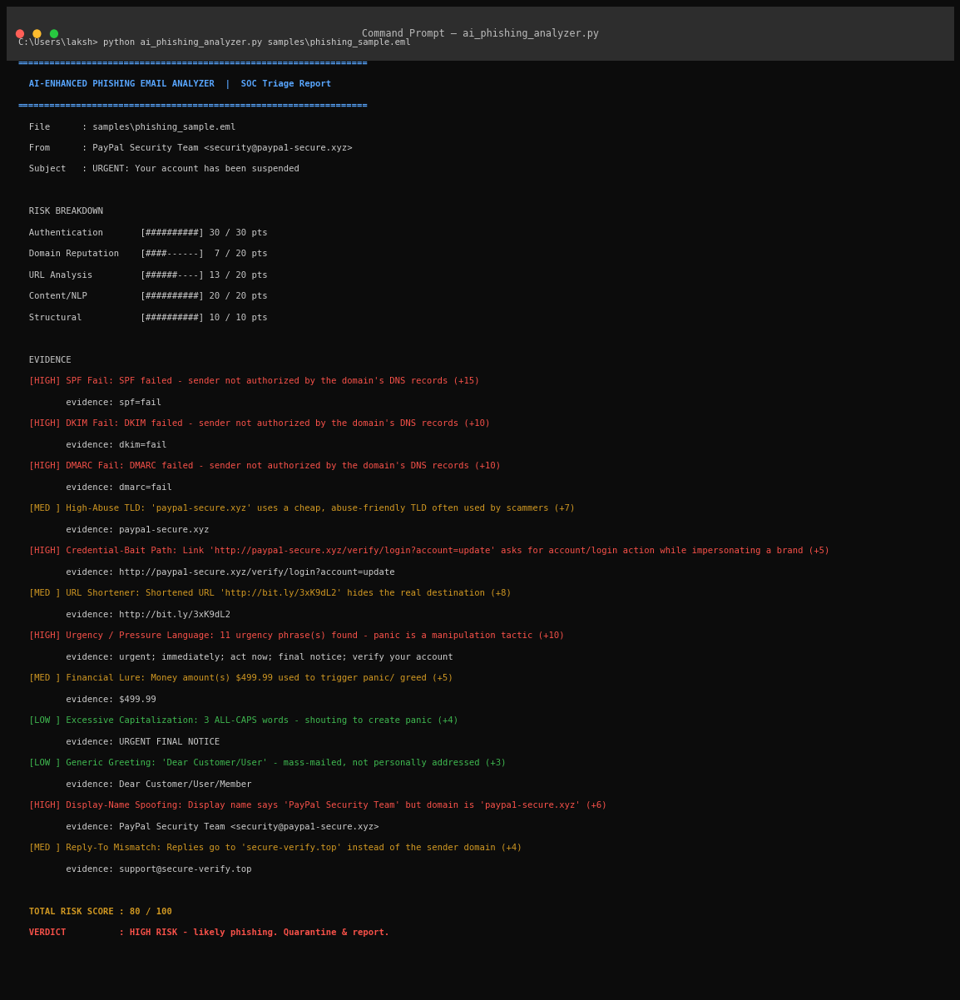
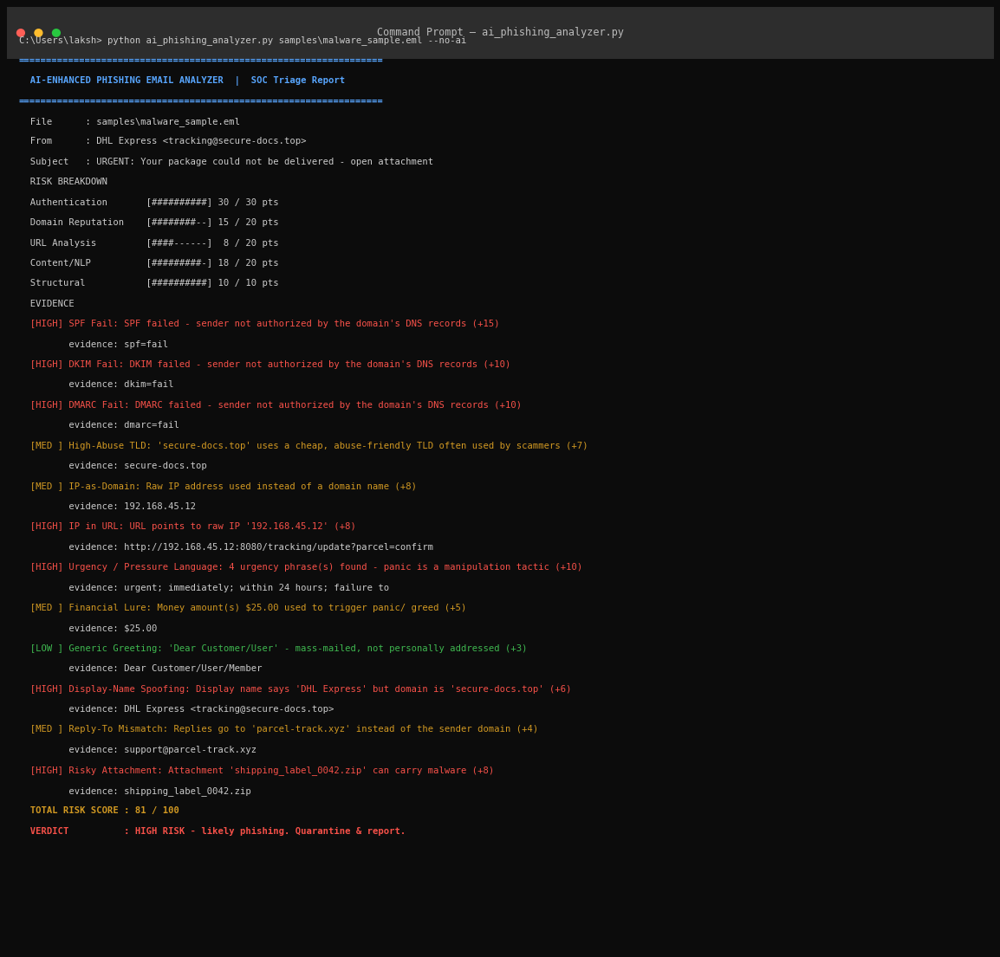
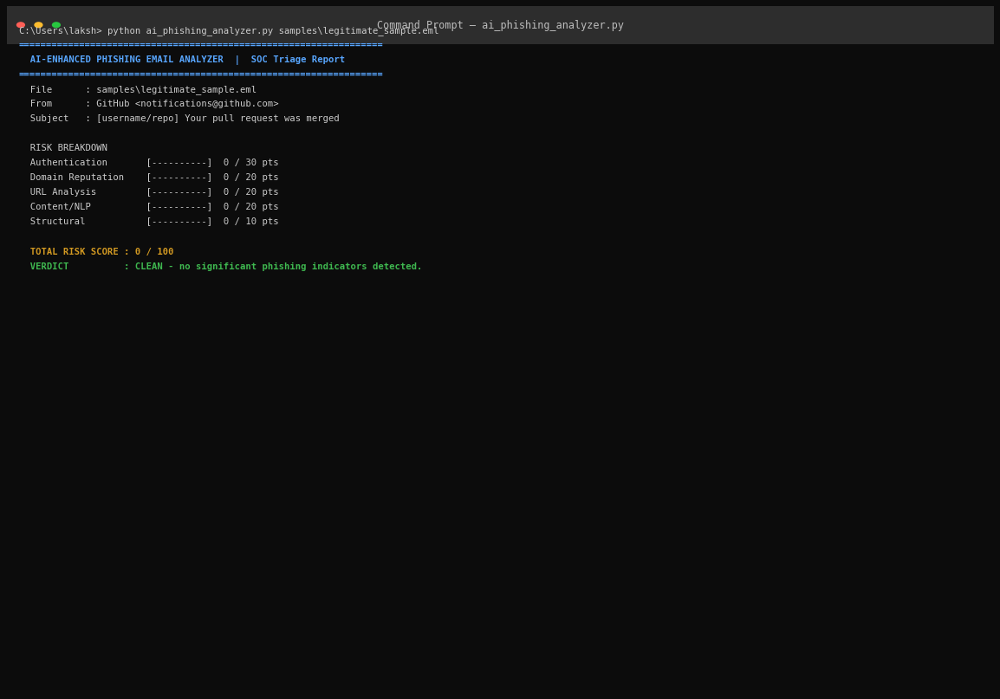
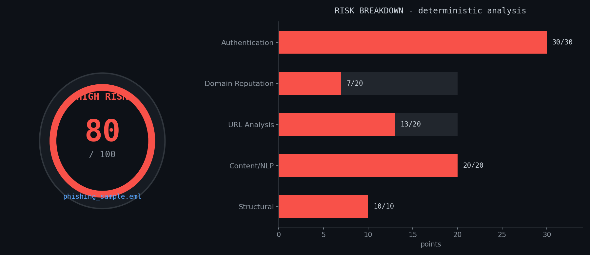
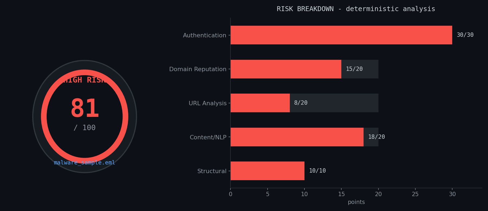

# 🛡️ AI-Enhanced Phishing Email Analyzer

**Deterministic phishing & malware-lure detection + local LLM analyst explanations — no cloud, no API keys, runs entirely offline.**

[](https://python.org)
[-000000)](https://ollama.com)
[](LICENSE)
[]()

A SOC-triage tool that scores any suspicious email out of **100** across five weighted
detection categories, then hands the structured findings to a **local Ollama LLM**
(`llama3.2`) which writes a Tier-1-SOC-analyst-style explanation — with strict rules
that forbid it from inventing evidence or overriding the deterministic score.

> ⚖️ Design philosophy: **the deterministic engine decides, the LLM only explains.**
> Every point in the score maps to a documented, reproducible check.

---

## 🎯 Features

- **5-category weighted risk model (100 pts)**

| Category | Max | What it detects |
|---|---|---|
| 🔐 Authentication | 30 | SPF / DKIM / DMARC failures parsed from `Authentication-Results` |
| 🌐 Domain Reputation | 20 | Typosquats (fuzzy matching vs 24 trusted brands), abuse-friendly TLDs, raw-IP hosts |
| 🔗 URL Analysis | 20 | Shorteners, `@` trick, deep subdomain chains, credential-bait paths, IPs in URLs |
| 🧠 Content / NLP | 20 | 23 urgency phrases, financial lures, ALL-CAPS shouting, generic greetings |
| 🧩 Structural | 10 | Display-name spoofing, Reply-To mismatch, risky attachments (`.exe`, `.zip`, `.js`…) |

- **🤖 Local AI explanation layer** — findings go to Ollama (`llama3.2`) and come back
  as a structured analyst brief: summary, red flags, investigation priorities, user
  action, and honest limitations. Skips gracefully if Ollama isn't running.
- **📦 Malware-lure detection** — phishing-adjacent samples with malicious attachments
  and IP-hosted payloads are flagged in the Structural category.
- **📄 Raw email support** — parses standard `.eml` files (Gmail "Download message" works as-is).
- **📊 Visual risk dashboards** — one command renders a gauge + category-bar PNG for any email.
- **🧾 JSON export** — one flag saves a complete, SIEM-ready report (`--json`).
- **Zero dependencies** — Python standard library only. The AI layer talks to Ollama's
  local HTTP API via `urllib` — no `pip install`, no API keys, fully offline.

---

## 🖥️ Demo

### Phishing sample (fake PayPal) → **80/100 — HIGH RISK**


### Malware-delivery sample (fake DHL + malicious attachment) → **81/100 — HIGH RISK**


### Legitimate control sample → **0/100 — CLEAN**


> The control sample is the important half of the demo: a detector that flags
> everything is useless in a SOC. **80/81 on threats, 0 on clean mail** = zero
> false positives on the control.

### Risk dashboards
| Phishing sample | Malware sample |
|---|---|
|  |  |

---

## 🚀 Quick Start

### Requirements
- **Python 3.8+** — no packages needed for the analyzer
- *(Optional)* `matplotlib` — only if you want dashboard images:
  ```bash
  pip install matplotlib
  ```
- *(Optional, for AI explanations)* [Ollama](https://ollama.com) + a small model:
  ```bash
  ollama pull llama3.2        # or: ollama pull llama3.2:3b
  ```

### ▶️ Run the analyzer — with AI
```bash
python ai_phishing_analyzer.py samples/phishing_sample.eml
python ai_phishing_analyzer.py samples/malware_sample.eml
python ai_phishing_analyzer.py samples/legitimate_sample.eml

# pick a specific Ollama model
python ai_phishing_analyzer.py samples/phishing_sample.eml --model llama3.2:3b
```

### ▶️ Run the analyzer — without AI
```bash
python ai_phishing_analyzer.py samples/phishing_sample.eml --no-ai
```

### 📊 Generate a risk dashboard image
```bash
# phishing dashboard -> samples/phishing_sample_dashboard.png
python make_dashboard.py samples/phishing_sample.eml

# malware dashboard
python make_dashboard.py samples/malware_sample.eml

# custom output name / location
python make_dashboard.py samples/phishing_sample.eml --out screenshots/03_risk_dashboard_phishing.png
```

### 🧾 Save a JSON report (SIEM-ready)
```bash
python ai_phishing_analyzer.py samples/phishing_sample.eml --json
# creates samples/phishing_sample_report.json
```

### 🔍 Analyze your own suspicious email
Export the email from Gmail (⋮ → **Download message**) or Outlook, save it as `.eml`
in `samples/`, then run any command above on it. The tool reads standard RFC-822
email as-is.

---

## 🏗️ Architecture

```
.eml file
   │
   ▼
┌─────────────────────────────────────────────┐
│  DETERMINISTIC ANALYZER (always runs)       │
│  Authentication → Domain → URL → NLP →      │
│  Structural ──► weighted score /100 +       │
│  evidence list                              │
└─────────────────────────────────────────────┘
   │ structured JSON findings
   ▼
┌─────────────────────────────────────────────┐
│  AI EXPLANATION LAYER (optional, local)     │
│  findings ──► constrained prompt ──►        │
│  Ollama (llama3.2, temp 0.2) ──► analyst    │
│  explanation: summary / red flags / next    │
│  steps / user action / limitations          │
└─────────────────────────────────────────────┘
   │
   ▼
Terminal report ──► *_report.json ──► *_dashboard.png
```

The LLM is **constrained by a strict prompt**: it may not invent indicators, URLs,
headers, or sender data; may not declare the message "definitely malicious"; and may
not change the deterministic score. `temperature: 0.2` keeps output factual.

---

## 📊 Scoring bands

| Score | Verdict | Action |
|---|---|---|
| 0–14 | 🟢 CLEAN | No significant indicators |
| 15–34 | 🟡 LOW | Minor indicators — monitor |
| 35–59 | 🟠 MEDIUM | Suspicious — verify before acting |
| 60–100 | 🔴 HIGH RISK | Likely phishing/malware — quarantine & report |

---

## 📁 Repository structure

```
AI_Phishing_Email_Analyzer/
├── ai_phishing_analyzer.py      # the complete analyzer + AI layer (single file)
├── make_dashboard.py            # risk-dashboard PNG generator (needs matplotlib)
├── samples/
│   ├── phishing_sample.eml      # fake PayPal credential-harvester
│   ├── malware_sample.eml       # fake DHL delivery + malicious .zip attachment
│   └── legitimate_sample.eml    # genuine-style GitHub notification (control)
└── screenshots/                 # demo evidence
```

---

## 🧪 Validation

| Sample | Indicators | Score | Verdict |
|---|---|---|---|
| `phishing_sample.eml` — paypa1-secure.xyz, SPF/DKIM/DMARC fail, shortener, urgency NLP | 12 | 80/100 | 🔴 HIGH RISK |
| `malware_sample.eml` — IP-hosted payload, risky .zip attachment, DHL spoof | 13 | 81/100 | 🔴 HIGH RISK |
| `legitimate_sample.eml` — GitHub notification, all auth checks pass | 0 | 0/100 | 🟢 CLEAN |

Every flagged point is attributable to a named check with visible evidence — the
score is auditable, not a black box.

---

## 🔭 Roadmap

- [ ] Batch mode over a folder of emails with per-file CSV export
- [ ] Public phishing corpus evaluation (Nazario / SpamAssassin sets)
- [ ] Attachment hash lookup (VirusTotal API, optional)
- [ ] Live SPF/DKIM/DMARC DNS checks for emails missing `Authentication-Results`

---

## ⚠️ Disclaimer

Educational / portfolio project. It is **not** a replacement for enterprise email
security (no sandboxing, no live URL reputation, no attachment detonation — the tool
states these limitations in its own AI report). Always report phishing to your SOC
and providers (APWG: reportphishing@apwg.org).

---

## 📜 License

MIT — free to use, modify, and learn from.
